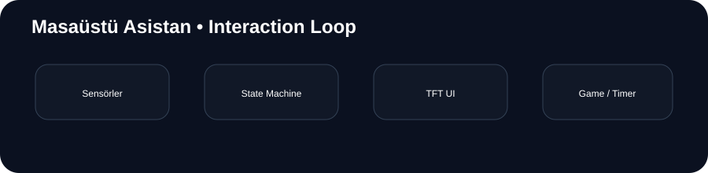
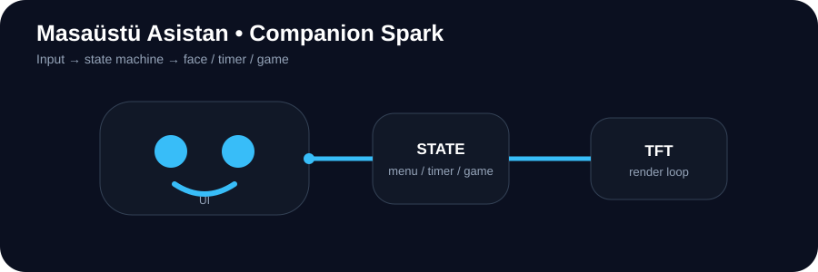

<div align="center">

# 🤖 Masaüstü Asistan

**ESP32 • TFT UI • Animasyon • Pomodoro • Mini Games**

Küçük bir TFT ekran üzerinde gerçek zamanlı yüz ifadeleri, etkileşimler, zamanlayıcılar ve oyun modları çalıştıran embedded companion projesi.





</div>

---

## ✨ Modüller

- 👀 Göz / emote animasyonları
- 🖐️ Sensör tabanlı etkileşim
- 📋 Menü ve mod geçişleri
- ⏱️ 25 dakikalık Pomodoro
- 🦖 Dino mini game
- 🐦 Flappy mini game
- 🎨 ST7789 TFT arayüzü

## 🧠 Yazılım Yapısı

```text
Sensor Input
     ↓
Event Detection
     ↓
State / Mode
  ┌──┼──────┐
  ↓  ↓      ↓
 UI Timer  Game
  ↓  ↓      ↓
       TFT
```

Tek/çift tıklama gibi girişler ilgili moda yönlendirilir. Oyunlarda input doğrudan karakter hareketine dönüştürülür.

## 🖥️ UI & Animation

Animasyon sistemi ekranı belirli zaman aralıklarında güncelleyerek göz/emote durumlarını değiştirir. Menü, Pomodoro ve oyun ekranları aynı cihaz üzerinde modüler şekilde çalışır.

## 🛠️ Donanım

ESP32 · ST7789 TFT · iki sensör · Arduino IDE · `Arduino_GFX_Library`

### Pinler

| Bileşen | Pin |
|---|---:|
| Sensör 1 | GPIO 34 |
| Sensör 2 | GPIO 35 |
| TFT CS | GPIO 15 |
| TFT DC | GPIO 27 |
| TFT RST | GPIO 33 |

## 🚀 Kurulum

1. ESP32 board desteğini Arduino IDE'ye ekleyin.
2. `Arduino_GFX_Library` yükleyin.
3. TFT ve sensörleri pin tablosuna göre bağlayın.
4. `masaustu_asistan.ino` dosyasını yükleyin.

## 📁 Yapı

```text
masaustu_asistan/
├── masaustu_asistan.ino
├── docs/flow.svg
├── docs/assistant-spark.svg
└── README.md
```

## 🚧 Durum

**Deneysel / aktif hobi projesi**

Gelecek: daha akıcı animation loop'ları, sesli feedback, yeni mini games ve sensör desteği.
